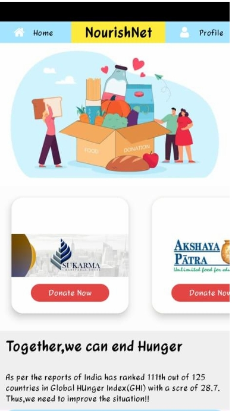

# 🍱 NourishNet: The Food Donation App

NourishNet is an Android mobile application designed to bridge the gap between food donors and NGOs. It aims to reduce food wastage by providing an easy-to-use platform where individuals can donate leftover food or money to organizations that serve the hungry.

Developed as a mini-project for Semester IV (2023–24) under the Department of Information Technology.

---

## 📲 Features

- 🔐 **User Authentication**: Secure sign-up and login.
- 📋 **NGO Directory**: Browse and read about various NGOs.
- 🍛 **Food Donation**: Donate cooked or raw food through checkboxes.
- 💸 **Cash Donations**: Donate money via UPI.
- 📅 **Scheduling**: Pick your preferred donation date and time.
- 🔔 **Notifications**: Get notified upon donation submission.
- 🧾 **Profile Management**: Update password, delete account, or log out.

---

## 📱 App Screenshots

### 🔸 Splash Screen


### 🔸 Sign-Up Page


### 🔸 Login Page


### 🔸 Homepage


### 🔸 NGO Details Page


### 🔸 Donation Options


### 🔸 Cash Donation


### 🔸 Notification Popup


---

## 🛠️ Tech Stack

- **Frontend**: Android Studio, Java, XML
- **Backend**: SQLite
- **Database**: Local (on-device) SQL operations
- **IDE**: Android Studio

This project is developed for academic purposes and is not licensed for commercial use.


## 📝 How to Run

1. Clone the repository:
   ```bash
   git clone https://github.com/your-username/nourishnet-app.git
